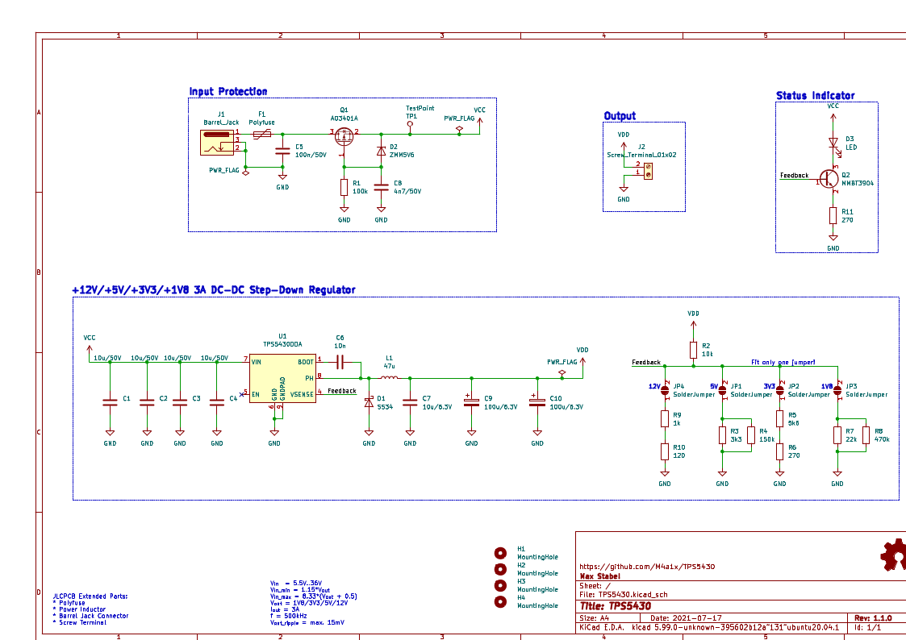

# TPS5430

This is a small DC-DC Buck converter board based on the TPS5430 from TI specifically intended to be ordered from [JLCPCB](jlcpcb.com/) with few "extended parts". This was a practice project for me, so please feel free to point out any [issues](https://github.com/M4a1x/TPS5430/issues).

## Features

* Vin = 5.5V..36V
* Vinmin = 1.15 * Vout (see Datasheet Section 8.2.1.2.8.1)
* Vinmax = 8.33 * (Vout + 0.5) (see Datasheet Section 8.2.1.2.8.1)
* Vout = 1.8V/3.3V/5V/12V (choose via solder bridge)
* Reverse polarity protection with AO3401A p-MOSFET
* 3A (hold)/6A (trip) polyfuse input protection
* The board can be powered with a 2.1mm/5.5mm "standard" Arduino compatible barrel jack connector.
* Status LED

## Schematic

The design was done in [KiCAD 6 nightly (aka 5.99)](https://www.kicad.org/) and follows the [TPS5430 datasheet (Section 8.2.1)](https://www.ti.com/lit/ds/symlink/tps5430.pdf) reasonably close in the schmatic as well as the layout (Section 10.2).

Deviations are:

* 2x 100uF tantalum capacitors instead of 1x 220uF, since those are basic parts at JLCPCB
* As suggested a 10uF output bypass capacitor is added
* 4x 10uF input capacitors instead of only 1x
* Multiple output voltage options through increased Inductor (47uH instead of 15uH) and solder jumpers. All outputs should work with the full 3A

## License

Licensed under CERN-OHL-S v2 or any later version. See `LICENSE` for more information.

## Contact

Max Stabel - [https://max.stabel.family/](https://max.stabel.family)

Project Link: [https://github.com/M4a1x/TPS5430](https://github.com/M4a1x/TPS5430)

## Acknowledgements

* [Philip Salamony](https://philsal.co.uk/) and his [BananaSchplit Project](https://github.com/pms67/BananaSchplit) and [Video](https://www.youtube.com/watch?v=qXWYXxDokv4)
* [ugurozkan52/TPS5430_Power_Module](https://github.com/ugurozkan52/TPS5430_Power_Module) which inspired me to add the output voltage jumpers
